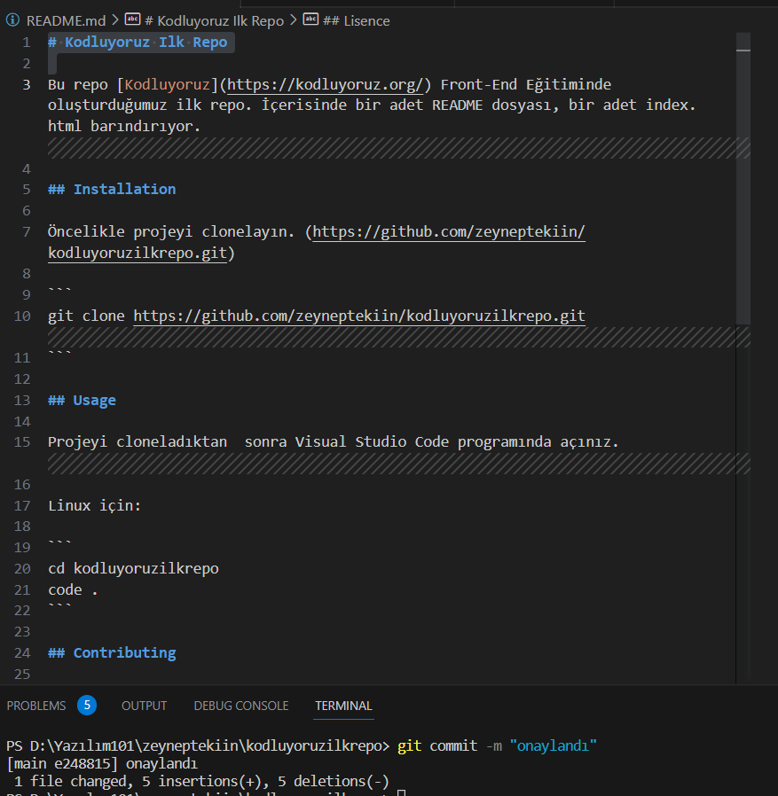

# Kodluyoruz Ilk Repo

Bu repo [Kodluyoruz](https://kodluyoruz.org/) Front-End Eğitiminde oluşturduğumuz ilk repo. İçerisinde bir adet README dosyası, bir adet index.html barındırıyor.

## Installation

Öncelikle projeyi clonelayın. (https://github.com/zeyneptekiin/kodluyoruzilkrepo.git)

```
git clone https://github.com/zeyneptekiin/kodluyoruzilkrepo.git
```

## Usage

Projeyi cloneladıktan  sonra Visual Studio Code programında açınız.

Linux için: 

```
cd kodluyoruzilkrepo
code .
```

## Contributing

Pull requestler kabul edilir. Büyük değişiklikler için, lütfen önce neyi değiştirmek istediğinizitartışmak için bir konu açınız.

## Project SS



## Lisence

[MIT]